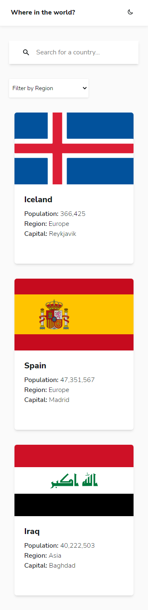
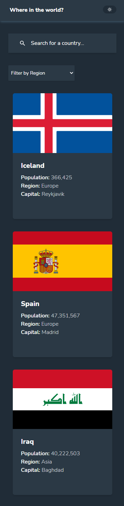
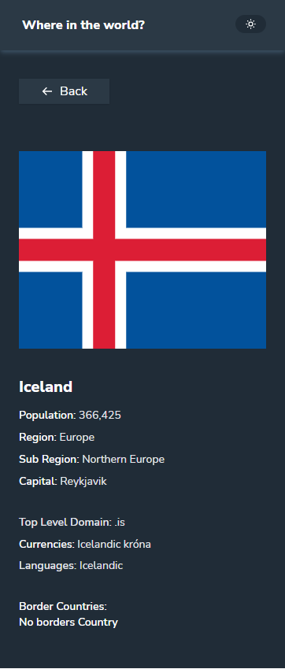
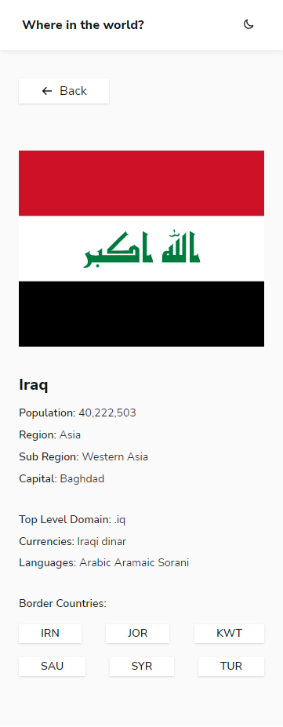
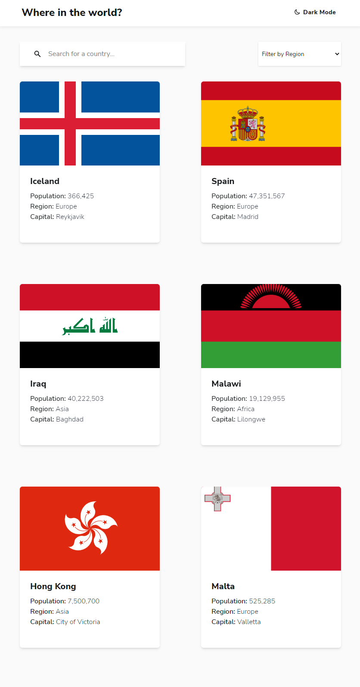
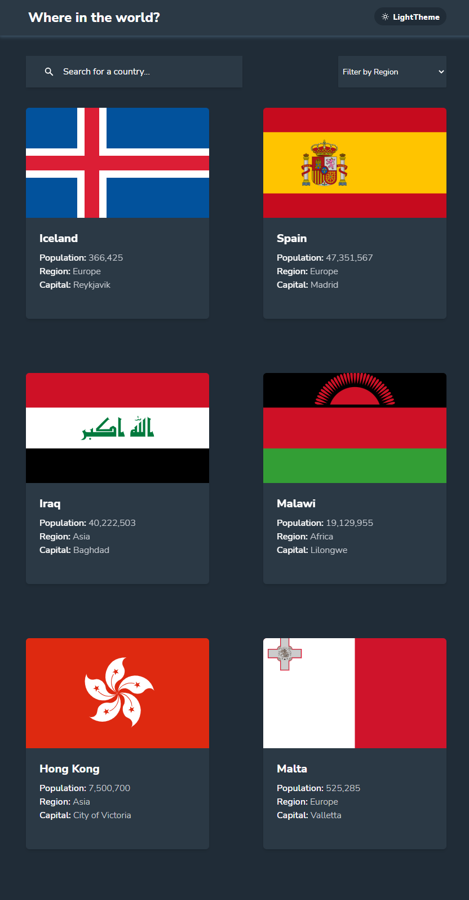
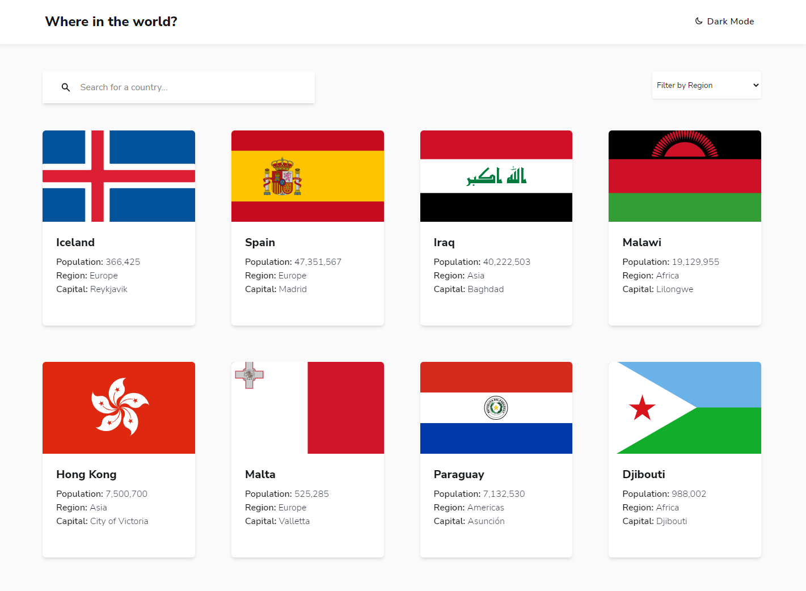
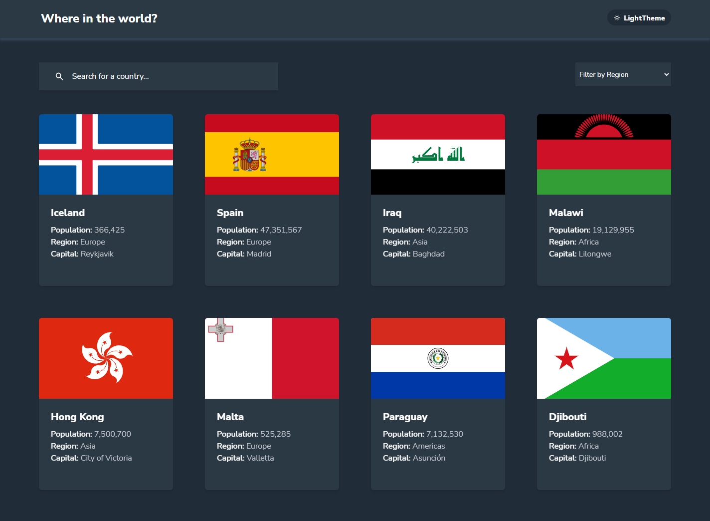

# Frontend Mentor - Rest Countries API

This is a solution to the [Rest Countries API challenge on Frontend Mentor](https://www.frontendmentor.io/challenges/rest-countries-api-with-color-theme-switcher-5cacc469fec04111f7b848ca/hub/rest-countries-api-with-color-theme-switcher-nBHoq7hRXT). Frontend Mentor challenges help you improve your coding skills by building realistic projects.

## Overview

### Screenshot

#### Mobile Device

#### Tablets

#### Desktop

### Links

- Solution URL: [Github](https://github.com/iamenochlee/countries-project)
- Live Site URL: [Vercel](https://countries-project-kappa.vercel.app/)

## My process

Another awesome challenge from FEM, interacted and pulled data from Rest Countries API. Added some more features, such as a scroll to Top button, that appears after the user scrolls above 500px, a custom 404 page, and much more.

### Built with

- Semantic HTML
- Next JS
- Acessibility
- Mobile First Approach
- TailwindCSS
- Grids
- Vite
- Custom Hooks
- Framer Motion
- React Icons
- React Hooks
- Local Storage
- Skeleton Screens

## Author

- enochlee

- Frontend Mentor - [@iamenochlee](https://www.frontendmentor.io/profile/iamenochlee)
- Twitter - [@iamenochlee](https://twitter.com/iamenochlee)
